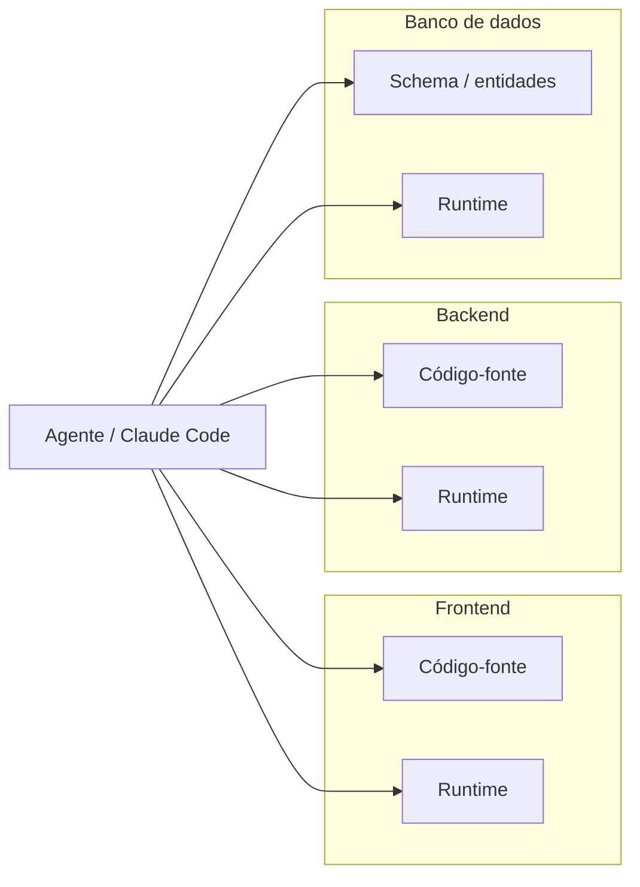

# pochete-toolkit

**Toolkit para codificação agêntica com Claude Code**

[](https://github.com/ivanzigoni/pochete-toolkit/releases)
[](LICENSE)
[](https://github.com/ivanzigoni/pochete-toolkit/actions/workflows/tag.yml)
[](https://github.com/ivanzigoni/pochete-toolkit/releases)
[](.claude/mcp/pctk__default/)

## Índice

- [O que é](#o-que-é)
- [Visibilidade de ponta a ponta](#visibilidade-de-ponta-a-ponta)
- [Ferramentas](#ferramentas)
- [Instalação](#instalação)
- [Projetos com vários repositórios](#projetos-com-vários-repositórios)
- [Espaço para o seu domínio](#espaço-para-o-seu-domínio)
- [Fluxo de trabalho](#fluxo-de-trabalho)
- [Segurança](#segurança)
- [Licença](#licença)

## O que é

Quem pratica codificação agêntica com o Claude Code enfrenta o mesmo par de problemas em todo
projeto: o agente precisa de mais contexto do que o código-fonte oferece sozinho (logs de
produção, dados de banco, PRs, issues), e esse acesso mais amplo cria superfície para
comportamento indesejado (ler um `.env`, rodar um comando fora de escopo). A pochete-toolkit
resolve os dois problemas: distribui ferramentas que ampliam o contexto do agente e do humano, e
contenções mecânicas — hooks e allowlists — que bloqueiam o que não deve acontecer, independente
da instrução no prompt.

É uma biblioteca (quase) não opinativa: não impõe como você organiza conhecimento, processos ou
fluxo de trabalho. A estrutura generalista apoia só nessas duas frentes e deixa o resto a seu
critério.

## Visibilidade de ponta a ponta

A ideia é dar ao agente visibilidade controlada e previsível, por meio de tools escritas sob os mesmos critérios do código-fonte dos projetos em que você trabalha.



## Ferramentas

| Ferramenta | O que faz |
|---|---|
| `bitbucket-open-pr` | Abre um pull request no Bitbucket. |
| `delegate-reasoning` | Expõe modelos de linguagem externos via HTTP, indicado para economia de tokens e paralelização de tarefas. |
| `jira-add-comment` | Adiciona um comentário a um issue no Jira Cloud. |
| `jira-create-issue` | Cria um issue no Jira Cloud. |
| `jira-get-issue` | Lê os dados de um issue no Jira Cloud. |
| `jira-search-issues` | Busca issues no Jira Cloud a partir de uma consulta JQL. |
| `portainer-get-container-logs` | Obtém logs em tempo real de containers de serviços no Portainer, para diagnóstico de problemas em produção e testes E2E. |
| `railway-safe-cli` | Executa comandos allowlisted da Railway CLI, localmente instalada, injetando token e projeto/ambiente sem exigir `railway login`. |
| `safe-curl` | Executa requisições curl autenticadas. |
| `safe-query` | Executa consultas SQL somente leitura, com uma camada de redação de dados sensíveis conforme a LGPD. |

## Instalação

### Requisitos

- Claude Code (CLI) instalado e autenticado.
- Node.js, para o servidor MCP em [.claude/mcp/pctk__default/](.claude/mcp/pctk__default/).
- Git.

> Os exemplos usam comandos Unix (`curl`, binários resolvidos via `PATH`). Suporte a Windows não
> foi confirmado.

RTK e CodeGraph são opcionais, mas indicados. A Railway CLI é opcional, conforme a necessidade.

### Onde colocar os projetos

Clone ou inicie cada repositório de aplicação em `project/`, um por subdiretório (ex.:
`project/meu-servico/`). O diretório fica fora do controle de versão deste repositório (veja
`.gitignore`) — a pochete-toolkit distribui só o workspace do agente, não o código das
aplicações. Seu projeto não precisa estar hospedado no GitHub ou similar.

Com vários repositórios, clone todos lado a lado em `project/`. Veja
[Projetos com vários repositórios](#projetos-com-vários-repositórios), abaixo.

<details>
<summary><strong>Instalar o RTK (opcional)</strong></summary>

O RTK ([rtk-ai/rtk](https://github.com/rtk-ai/rtk)) reduz o volume de tokens do agente ao filtrar
e compactar a saída de comandos do terminal. Este repositório já versiona o hook e os filtros do
projeto — falta só instalar o binário na sua máquina.

Siga as instruções em [github.com/rtk-ai/rtk](https://github.com/rtk-ai/rtk).

Confirme a instalação:

```sh
rtk --version
```

Não precisa de configuração adicional: com o binário no `PATH`, o Claude Code passa a usar o RTK
automaticamente nas próximas sessões.

</details>

<details>
<summary><strong>Instalar o CodeGraph (opcional)</strong></summary>

O CodeGraph ([colbymchenry/codegraph](https://github.com/colbymchenry/codegraph)) mantém, por
projeto, um grafo de conhecimento em SQLite dos símbolos, arestas e arquivos do código-fonte,
exposto ao agente pela tool `codegraph_explore`. Este repositório já versiona o registro do
servidor MCP e as permissões que o tornam padrão (sem prompt a cada chamada), em `.mcp.json` e
`.claude/settings.json` — falta só instalar o binário e inicializar o índice em cada repositório
de aplicação.

Siga as instruções em
[github.com/colbymchenry/codegraph](https://github.com/colbymchenry/codegraph).

Confirme a instalação:

```sh
codegraph --version
```

> **Não rode `codegraph install`.** Esse comando cadastra o servidor MCP no agente — aqui esse
> cadastro já está versionado em `.mcp.json` e `.claude/settings.json`.

Depois de clonar cada repositório de aplicação em `project/` (veja
[Onde colocar os projetos](#onde-colocar-os-projetos), acima), rode na raiz de cada um:

```sh
codegraph init
```

Isso constrói o índice inicial, salvo em `.codegraph/`, local a cada máquina. O próprio
`codegraph init` grava ali um `.gitignore` que impede o commit do índice — não precisa editar o
`.gitignore` do repositório de aplicação por causa disso.

</details>

<details>
<summary><strong>Instalar a Railway CLI (opcional)</strong></summary>

A tool `railway-safe-cli` executa o binário real da
[Railway CLI](https://docs.railway.com/guides/cli), instalado localmente por você — nunca
autenticado via `railway login`. O token de cada projeto fica num `.env` próprio da tool e é
injetado por chamada. Todo comando nasce bloqueado: um hook dedicado impede o agente de invocar
`railway` fora dessa tool, e um segundo arquivo decide quais subcomandos estão liberados na
sessão.

Siga as instruções em [docs.railway.com/guides/cli](https://docs.railway.com/guides/cli).
Confirme a instalação no seu próprio terminal:

```sh
railway --version
```

> Não peça ao agente para confirmar por você — o hook bloqueia esse tipo de invocação de
> propósito.

Depois, em `.claude/mcp/pctk__default/src/tools/railway-safe-cli/`, copie os três arquivos de
exemplo para os equivalentes reais (gitignorados) e preencha à mão:

| Arquivo de exemplo | Arquivo real | Conteúdo |
|---|---|---|
| `.env.example` | `.env` | Token por projeto |
| `auth-profiles.example.json` | `auth-profiles.json` | Projeto/ambiente por profile |
| `command-allowlist.example.json` | `command-allowlist.json` | Subcomandos liberados (nasce vazio) |

</details>

## Projetos com vários repositórios

A pochete-toolkit funciona bem em projetos com vários repositórios. Você acumula conhecimento de
domínio em `.claude/rules/user/` ao longo do tempo — isso melhora a precisão do agente.

## Espaço para o seu domínio

A pochete-toolkit distribui skills, rules, conventions, material de referência e servidor MCP
próprios sob o prefixo `pctk__`. Você cria os mesmos tipos de artefato para o domínio do seu
workspace, também sob o prefixo `user__`:

```
.
├── project/                                            # repositórios de aplicação (fora do versionamento)
└── .claude/
    ├── skills/
    │   ├── pctk__<categoria>__<nome>.skill/SKILL.md    # skill, framework
    │   └── user__<categoria>__<nome>.skill/SKILL.md    # skill, domínio
    ├── rules/
    │   ├── default/
    │   │   └── pctk__<nome>.md                         # rule ou convention, framework
    │   └── user/
    │       └── user__<nome>.md                         # rule ou convention, domínio
    ├── reference/
    │   ├── default/
    │   │   └── pctk__<nome>.md                         # referência, framework
    │   └── user/
    │       └── user__<nome>.md                         # referência, domínio
    └── mcp/
        ├── pctk__default/                              # servidor MCP, framework
        └── user__<nome>/                               # servidor MCP, domínio
```

Rule e convention são o mesmo tipo de arquivo — a diferença é só o campo `paths:` no
frontmatter (presente numa rule escopada, ausente numa convention sempre carregada).

Path exato, mecanismo de descoberta e passo a passo em
[pctk__agent-user-extensions.md](.claude/rules/default/pctk__agent-user-extensions.md).

Tudo sob `user__` fica fora do controle de versão deste repositório (veja `.gitignore`), sem
configuração adicional.

## Fluxo de trabalho

O fluxo de trabalho de uma tarefa usa quatro diretórios internos, filhos diretos de `.claude/`,
rastreados por `.gitkeep` com conteúdo ignorado pelo `.gitignore`:

| Diretório | Propósito |
|---|---|
| `.claude/__workdir/` | Tarefas rastreadas em andamento, uma pasta por task. |
| `.claude/__stash/` | Arquivo dos workdirs já concluídos. |
| `.claude/__tmp/` | Scratch efêmero, descartável ao final da tarefa. |
| `.claude/__assets/` | Assets ou documentos de referência mantidos entre sessões. |

A skill `pctk__workflow__create-workdir` cria a tarefa rastreada e a vincula a um repositório de
aplicação, com sua própria worktree git. O detalhamento de cada diretório — incluindo a resolução
de nome nu ("salva no tmp", "joga no stash") — está em
[pctk__agent-internal-dirs.md](.claude/rules/default/pctk__agent-internal-dirs.md).

## Segurança

A pochete-toolkit segue a filosofia zero trust:

- **Opt-in por allowlist:** navegação entre diretórios, comandos de git permitidos e execução de
  CLI externa fora da tool que a encapsula (ex.: Railway CLI, só via `railway-safe-cli`).
- **Bloqueio mecânico:** o agente não lê `.env`, chaves de API, credenciais, senhas nem outro
  artefato sensível de autenticação.

## Licença

Distribuído sob a licença Apache 2.0. Veja [LICENSE](LICENSE).
